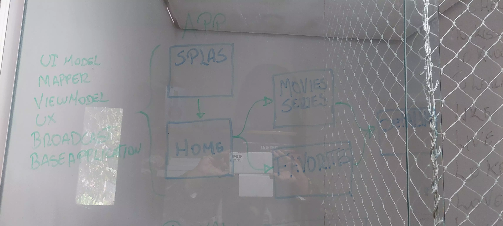
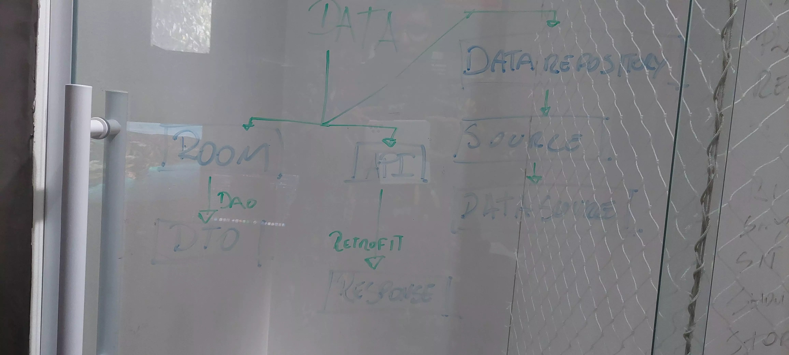
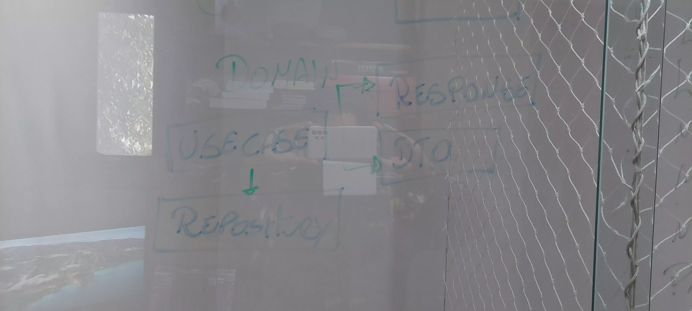

# Zygo Challenge :rocket:

## Sumário

- [Introdução](#introdução)
- [Módulos](#módulos)
- [Demo](#demo)
- [Melhorias](#melhorias)
- [Bibliotecas](#bibliotecas)
- [Licença](#licença)

## Introdução
O objetivo deste projeto é completar o challenge da Zygo utilizando os princípios da Clean Architecture e SOLID,
trazendo-os para o Android. Vale a pena dizer que a ideia é aproveitar as vantagens das linguagens de programação Kotlin,
além de extrair lições aprendidas e ideias de outras abordagens interessantes, e de outros projetos que passei, como também a programação funcional,
Configuração de projeto usando `MVVM`, `Koin`, `Coroutines`, `Flow` e` LiveData` com arquitetura modular.
Usufruindo para layout e navegação `View-Binding`, `DarkTheme`, `Navigation`, `Lottie`, `SSP`, `SDP` e `Material`
Para camada de dados foi usado `Retrofit`, `Http3`, `Room` e `Moshi`
Em questões de qualidade, esta usando Firebase `Crashlytics`, `Performance`

## Módulos
* *app* - Application module - Esse módulo tem acesso a *toda aplicação*.
* *data* - Android module - Esse módulo *tem acesso apenas ao domain módulo*
* *domain* - Android module - Esse módule *não tem acesso a outros módulos*

### Módulo APP
Responsável pelas classes de UI, possui uma Splash com uma animação utilizando Lottie, uma Main com TabView gerênciando os Fragments
que por meio de LiveData observam as suas Respectivas Viewmodels. Temos uma  classe BaseApplication responsável pela inicialização do
Koin para injeção de depêndencia. Também possui o broadcast para observar alterações de rede e notificar o usuario.

### Módulo Data
Orquestra as chamadas para a API e ROOM que são acessados respectivamente pelas interfaces DataSource e DAO

### Módulo Domain
Possui o UseCase que faz a ligação do modulo App com a interface Repository que requisita os dados da API e Room que estão mapeados
nas Entidades para apresentar na camada de app.

## Demo

## Melhorias
- Tranformar modulos em Dynamics
- Implementar testes de UI, Integração e Unitários
- Colocar busca
- Colocar detalhes das temporadas
- Configurar Proguard
- Implementar KTLint e KTFormart
- Opção de deletar Favorito
- Colocar pullRefresh na homet

## Bibliotecas

* [Coroutines][0] Library support for Kotlin coroutines.
* [Flows][1] for asynchronous data streams (still in experimental version).
* [LiveData][2] for reactive style programming (from VM to UI).
* [Navigation][3] for in-app navigation.
* [Koin][4] for dependency injection.
* [Retrofit][5] for REST api communication.
* [Timber][6] for logging.
* [Glide][7] Image downloading and caching library.
* [Sdp][8] Provides a new size unit - sdp (scalable dp).
* [Ssp][9] Provides a new size unit for text - ssp (scalable sp).
* [Lottie][10] Parses Adobe After Effects animations exported as json with Bodymovin and renders them natively on mobile.

[0]:  https://github.com/Kotlin/kotlinx.coroutines
[1]:  https://kotlin.github.io/kotlinx.coroutines/kotlinx-coroutines-core/kotlinx.coroutines.flow/-flow/
[2]:  https://developer.android.com/topic/libraries/architecture/livedata
[3]:  https://developer.android.com/topic/libraries/architecture/navigation/
[4]:  https://github.com/google/dagger
[5]:  https://github.com/square/retrofit
[6]:  https://github.com/JakeWharton/timber
[7]:

## Licença

    Copyright 2021 Luiz D'Avila

    Licensed under the Apache License, Version 2.0 (the "License");
    you may not use this file except in compliance with the License.
    You may obtain a copy of the License at

       http://www.apache.org/licenses/LICENSE-2.0

    Unless required by applicable law or agreed to in writing, software
    distributed under the License is distributed on an "AS IS" BASIS,
    WITHOUT WARRANTIES OR CONDITIONS OF ANY KIND, either express or implied.
    See the License for the specific language governing permissions and
    limitations under the License.